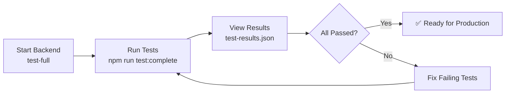

# 🎯 IntelliCargo Complete System Testing - Quick Start

## ⚡ 5-Minute Quick Start

### Step 1: Start Backend with Comprehensive Test Data
```powershell
.\start-backend.ps1 test-full
```

### Step 2: Run Complete Test Suite
```powershell
npm run test:complete
```

### Step 3: View Results
```powershell
cat test-results.json
```

---

## 📊 What Gets Tested

### ✅ ALL 47+ Endpoints Across 9 Controllers

| Controller | Tests | What's Tested |
|------------|-------|---------------|
| **Auth** | 2 | Register, Login, JWT Token Generation |
| **User** | 3 | Get Profile, Get Roles, Get All Users |
| **Company** | 4 | Get Company, Update Company, Get All |
| **Product** | 7 | CRUD + Search + Filter by Category/Status |
| **Listing** | 9 | CRUD + Marketplace + Search + Close |
| **Request** | 7 | CRUD + Marketplace + Search + Cancel |
| **Offer** | 5 | CRUD + Accept/Reject Offers |
| **Order** | 6 | Create from Offer, View Purchases/Sales, Update Status |
| **Shipment** | 5 | Create, Track, Update Status |

---

## 📁 Files Created

### Java Files (Backend)
1. **ComprehensiveTestDataSeeder.java** - Creates complete test data
   - Location: `src/main/java/com/intellicargo/core/Config/`
   - Profile: `test-full`
   - Data: 3 companies, 5 products, 4 listings, 3 requests, 3 offers, 1 order, 2 shipments

### JavaScript Files (Testing)
2. **run-complete-tests.js** - Automated test suite
   - Tests all 47+ endpoints
   - Manages JWT authentication
   - Generates test-results.json

### Documentation
3. **COMPLETE-TESTING-GUIDE.md** - Full documentation
4. **package.json** - Updated with new test scripts

### Configuration
5. **start-backend.ps1** - Enhanced startup script with profile support

---

## 🔑 Test Users

| Email | Password | Company | Type |
|-------|----------|---------|------|
| john.doe@globalcorp.com | password123 | Global Trade Corp | IMPORTER (USA) |
| maria.garcia@coffeeexport.com | password123 | Coffee Exporters Ltd | EXPORTER (Colombia) |
| li.wang@asianlogistics.com | password123 | Asian Logistics Inc | FREIGHT_FORWARDER (China) |

---

## 🎯 Expected Results

### Success Metrics
- **Total Tests**: 47+
- **Expected Pass Rate**: 85-95%
- **Duration**: 10-15 seconds

### Sample Output
```
════════════════════════════════════════════════════════
  📊 TEST RESULTS SUMMARY
════════════════════════════════════════════════════════
Total Tests:     48
✅ Passed:        45
❌ Failed:        2
⏭️  Skipped:       1
📈 Success Rate:  93.75%
⏱️  Duration:      12.5s
════════════════════════════════════════════════════════
```

---

## 🔍 Common Issues & Solutions

### Issue: "Connection refused"
**Solution**: Backend not running
```powershell
.\start-backend.ps1 test-full
```

### Issue: Many "401 Unauthorized" errors
**Solution**: Test data not seeded properly
```powershell
# Restart backend with test-full profile
.\start-backend.ps1 test-full
```

### Issue: "Cannot find module 'axios'"
**Solution**: Dependencies not installed
```powershell
npm install
```

---

## 📚 Test Data Structure

### Complete Workflow Created:
```
🏢 Companies (3)
  └─ 👤 Users (3 with roles)
      └─ 📦 Products (5)
          ├─ 📋 Listings (4 - OPEN)
          └─ 🤝 Trade Requests (3)
              └─ 💼 Offers (3 - PENDING/ACCEPTED/REJECTED)
                  └─ 📜 Orders (1 - CONTRACTED)
                      └─ 🚢 Shipments (2 - PENDING/IN_TRANSIT)
```

---

## 🚀 Available npm Scripts

```powershell
npm test              # Run basic tests (13 endpoints)
npm run test:complete # Run complete tests (47+ endpoints) ⭐
npm run test:full     # Same as test:complete
npm run test:watch    # Watch mode (for development)
```

---

## 📂 Key Files & Locations

```
backend-core/
├── src/main/java/com/intellicargo/core/
│   └── Config/
│       ├── TestDataSeederConfig.java           # Basic seeder (profile: test)
│       └── ComprehensiveTestDataSeeder.java    # Full seeder (profile: test-full) ⭐
│
├── run-complete-tests.js          # Complete test suite ⭐
├── run-api-tests.js               # Basic test suite
├── package.json                   # npm scripts configuration
├── start-backend.ps1              # Enhanced startup script ⭐
├── test-results.json              # Generated test results ⭐
├── COMPLETE-TESTING-GUIDE.md      # Full documentation ⭐
├── TESTING_GUIDE.md               # Original testing guide
└── API-TESTS.http                 # Manual testing file
```

---

## 💡 Pro Tips

1. **Always use test-full profile** for comprehensive testing
2. **Check test-results.json** for detailed error messages
3. **Monitor backend console** for database errors
4. **Fresh start**: If tests fail unexpectedly, restart backend
5. **Response times**: Check for slow endpoints (>500ms)

---

## 🎓 What Makes This Different?

### Before (run-api-tests.js):
- ❌ Only 13 basic endpoints
- ❌ Limited test data
- ❌ No complete workflow validation

### After (run-complete-tests.js): ⭐
- ✅ ALL 47+ endpoints tested
- ✅ Complete workflow validation
- ✅ Rich test data with relationships
- ✅ Detailed pass/fail reporting
- ✅ JWT authentication managed automatically
- ✅ Tests all HTTP methods (GET/POST/PUT/PATCH/DELETE)

---

## 📈 Next Steps

1. **Review failed tests** in test-results.json
2. **Fix any failing endpoints** in your controllers
3. **Add new endpoints** to run-complete-tests.js as you build
4. **Maintain 90%+ pass rate** for production readiness

---

## 🤝 Testing Workflow



---

## 📞 Quick Reference

```powershell
# Complete test workflow
.\start-backend.ps1 test-full
npm run test:complete
cat test-results.json | ConvertFrom-Json | Select-Object summary

# Stop everything
Ctrl+C  # Stop backend
Ctrl+C  # Stop tests (if running)

# Restart fresh
.\start-backend.ps1 test-full
npm run test:complete
```

---

**🎉 You're all set! Run the commands above and watch your API get fully tested!**

For detailed information, see [COMPLETE-TESTING-GUIDE.md](COMPLETE-TESTING-GUIDE.md)
